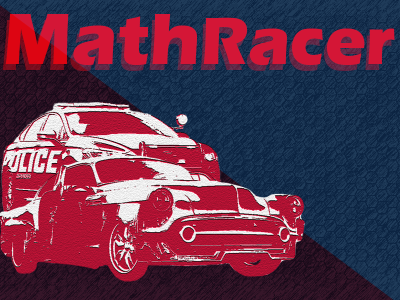

# mathRacer
This game written in c++ and SDL3 library.

There are lots of ways to make a game. The simplest way is to use a game engine like Unity , Godot, game maker studio, unreal engine or etc, but I chose the hardest way: using SDL version 3 to make a game.
 
SDL stands for Simple DirectMedia Layer.
In simple terms: it’s a C library that helps you make games and multimedia apps by handling things like:
-	creating windows
-	drawing graphics
-	reading keyboard/mouse/gamepad input
-	playing sound
So instead of talking directly to Windows/Linux/macOS APIs, you use SDL3 as a simpler cross-platform layer.
 
I had no clue where to start, so I searched everywhere, but everything was still super blurry. Their official docs had tutorials and examples, but they just didn’t click for a complete newbie like me. Sure, there’s tons of info out there for version 2, but I’m dead set on using the latest version—I want the real deal 
It’s 2026, and since we have access to advanced AI, I decided to go for it. I asked ChatGPT to help me learn the ropes and build my game. I know, I know! I said I chose the hardest way, but sometimes we can cheat a little. 
Let’s get back to my game. What’s the idea behind it?
You control a beautiful car, and the police are trying to catch you. To escape, you have to shift gears—but how? By solving math problems. Sounds cool, right? Solve them quickly and drive away!
 
I love graphic design, so I started by creating the assets I needed. First, I designed the game background in Photoshop, then built the menu. For the cars, I cheated again and downloaded some textures from itch.io. Now, everything is ready for coding! 
For coding, I used C++. I realized that the core SDL3 library wasn’t enough on its own. I needed SDL_image to load textures, SDL_ttf to render text and fonts, and SDL_mixer to handle the game’s audio. Finally, after a week of work, my game was ready!  
The game definitely has a lot of room for improvement, and I’d be happy to hear any ideas you have to make it even better! 
